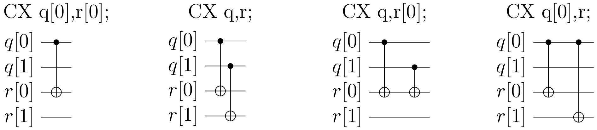
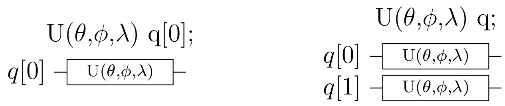
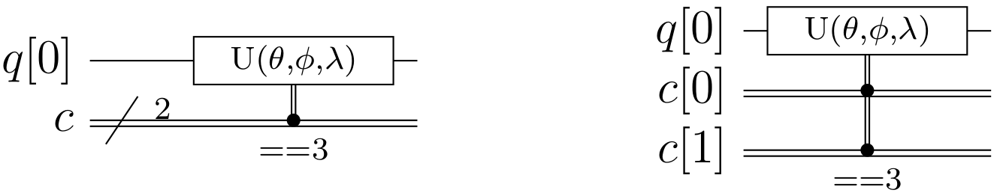
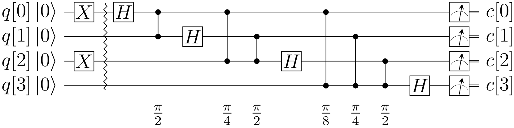
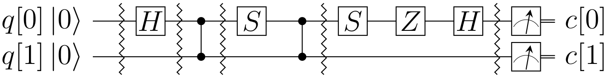
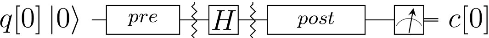

==============================
Open Quantum Assembly Language
==============================

Background
==========

Software architectures, compilers, and languages specifically for
quantum computing have been studied by the academic community for more
than a decade ([Sel04]_, [Gay06]_, [SCHC06]_, [HSST16]_) and
references therein). Researchers have implemented software and
simulators that can be used in practice to study quantum algorithms at
many scales. While we cannot survey this work here, we list a few of
these projects, several of which include software that has been made
readily available: Liquid ([WeSv14]_, [Liq16]_), Scaffold ([JPKH14]_,
[Sca16]_), Quipper ([VRSS15]_, [GLRS13]_, [Qui13]_), ProjectQ
([StTH16]_, [PrQ17]_ ), QCL ([Omer03]_, [Omer98]_), Quiddpro
([VGMH04]_, [ViMH05]_), Chisel-q ([LiKu13]_, [Chi16]_), and Quil
([SmCZ16]_, [Quil17]_).

Our goal in this document is to describe an interface language for the
Quantum Experience that enables experiments with small depth quantum
circuits. The language can be generated by the Composer, hand-written,
or targeted by higher level software tools, such as those
above. Before we do so, we discuss quantum programs in general to
provide context.  General quantum programs require coordination of
quantum and classical parts of the computation. One way to think about
general quantum programs is to identify their distinct phases of
execution ([GLRS13]_). :numref:`blocks` shows a high-level diagram of
the processes and abstractions involved in specifying a quantum
algorithm, transforming the algorithm into executable form, running an
experiment or simulation, and analyzing the results. A key idea
throughout these processes is the use of intermediate
representations. An intermediate representation (IR) of a computation
is neither its source language description, nor the target machine
instructions, but something in between. Compilers may use several IRs
during the process of translating and optimizing a program.

Compilation
===========

This phase takes place on a classical computer in a setting where
specific problem parameters are not yet known and no interaction with
the quantum computer is required, i.e. it is offline.  The input is
source code describing a quantum algorithm and any compile time
parameters. The output is a combined quantum/classical program
expressed using a high level IR. During this phase, it is possible to
compile classical procedures into object code and make initial passes
that do not require complete knowledge of the problem parameters.

Circuit generation
==================

This takes place on a classical computer in an environment where
specific problem parameters are now known, and some interaction with
the quantum computer may occur, i.e. this is an online phase. The
input is a quantum/classical program expressed using a high level IR,
as well as all remaining problem parameters. The output is a
collection of quantum circuits, or quantum basic blocks, together with
associated classical control instructions and classical object code
needed at run-time. A basic block is a straight-line code sequence
with no branches (except at the entry and exit points). Since feedback
can occur on multiple time scales, the quantum circuits may include
instructions for fast feedback. Other classical control instructions
outside of the quantum circuit basic block include, for example,
run-time parameter computations and measurement-dependent branches.
External classical object code could include algorithms to process
measurement outcomes into control flow conditions or results, or to
generate new basic blocks on the fly. The output of circuit generation
is expressed using a quantum circuit IR. Further circuit generation
may occur based on processed measurement results.

Execution
=========

This takes place on physical quantum computer controllers
in a real-time environment, i.e. the quantum computer is active. The
input is a collection of quantum circuits and associated run-time
control statements expressed using a quantum circuit IR. The input is
processed by a high-level controller into a stream of real-time
instructions in a low-level format that corresponds to physical
operations. These are executed on a low-level controller, and a
corresponding results stream provides measurement data back to the
high-level controller when needed. In general, the high level controller
(or virtual machine) can execute classical control instructions and
external object code. The output of circuit execution is a collection of
processed measurement results returned from the high-level controller.

Post-processing
===============

This takes place on a classical computer after all
real-time processing is complete. The input is a collection of processed
measurement results, and the output is intermediate results for further
circuit generation and/or the final result of the quantum computation.

.. figure:: figs/blocks.png
	 :name: blocks
	 :width: 17.00000cm

	 Block diagrams of processes (blue) and abstractions (red) to
	 transform and execute a quantum algorithm. The emphasized quantum
	 circuit abstraction is the main focus of this document. The API and
	 Resource Manager (green) represents the gateway to backend processes
	 for circuit execution. Dashed vertical lines separate offline,
	 online, and real-time processes.

Our model of program execution on the Quantum Experience does not allow
fully general classical computations in the loop with quantum
computations, as described above, because qubits remain coherent for a
limited time. Quantum programs are broken into distinct circuits whose
quantum outputs cannot be carried over into the next circuit. Classical
computation is done between quantum circuit executions. Users actively
participate in the circuit generation phase and manually implement part
of feedback path through the high level controller in
:numref:`blocks`, observing outcomes from the previous quantum circuit
and choosing the next quantum circuit to execute. Making use of an API
to the execution phase, users can write their own software for
compilation and circuit generation that interacts with the hardware over
a sequence of quantum circuit executions. After obtaining all of the
processed results, users may post-process the data offline.

We specify part of a quantum circuit intermediate representation based
on the quantum circuit model, a standard formalism for quantum
computation ([NiCh00]_). The quantum circuit abstraction
is emphasized in :numref:`blocks`. The IR expresses quantum circuits
with fast feedback, such as might constitute the basic blocks of a
full-featured IR. A basic block is a straight-line code sequence with no
branches (except at the entry and exit points). We have chosen to
include statements that are essential for near-term experiments and that
we believe will be present in any future IR. The representation will be
quite familiar to experts.

The human-readable form of our quantum circuit IR is based on “quantum
assembly language” ([Chu05]_, [Cro05]_, [SCHC06]_, [BaKO05]_,
[DoSP16]_) or QASM (pronounced *kazm*). QASM is a simple text language
that describes generic quantum circuits. QASM can represent a
completely “unrolled” quantum program whose parameters have all been
specified.  Most QASM variants assume a discrete set of quantum gates,
but our IR is designed to control a physical system with a
parameterized gate set.  While we use the term “quantum assembly
language”, this is merely an analogy and should not be taken too far.

Open QASM represents universal physical circuits, so we propose a
built-in gate basis of arbitrary single-qubit gates and a two-qubit
entangling gate (CNOT) [BBCD95]_. We choose a simple language without
higher level programming primitives. We define different gate sets
using a subroutine-like mechanism that hierarchically specifies new
unitary gates in terms of built-in gates and previously defined gate
subroutines. In this way, the built-in basis is used to define
hardware-supported operations via standard header files. The
subroutine mechanism allows limited code reuse by hierarchically
defining more complex operations ([JPKH14]_; [DoSP16]_). We also add
instructions that model a quantum-classical interface, specifically
measurement, state reset, and the most elemental classical feedback.

The remaining sections of this document specify Open QASM and provide
examples.

.. _section_language:

Language
========

The syntax of the human-readable form of Open QASM has elements of C
and assembly languages. The first (non-comment) line of an Open QASM
program must be :code:`OPENQASM M.m;` indicating a major version M and
minor version m.  Version 2.0 is described in this document. The
version keyword cannot occur multiple times in a file. Statements are
separated by semicolons.  Whitespace is ignored. The language is case
sensitive. Comments begin with a pair of forward slashes and end with
a new line. The statement :code:`include “filename”;` continues parsing
filename as if the contents of the file were pasted at the location of
the include statement. The path is specified relative to the current
working directory.

The only storage types of Open QASM (version 2.0) are classical and
quantum registers, which are one-dimensional arrays of bits and
qubits, respectively. The statement :code:`qreg name[size];` declares
an array of qubits (quantum register) with the given name and
size. Identifiers, such as name, must start with a lowercase letter
and can contain alpha-numeric characters and underscores. The label
name[j] refers to a qubit of this register, where :math:`j\in
\{0,1,\dots,\mathrm{size}(\mathrm{name})-1\}`. The qubits are
initialized to :math:`|0\rangle`. Likewise, :code:`creg name[size];`
declares an array of bits (register) with the given name and size. The
label :code:`name[j]` refers to a bit of this register, where
:math:`j\in \{0,1,\dots,\mathrm{size}(\mathrm{name})-1\}`. The bits
are initialized to :math:`0`.

	 The built-in two-qubit entangling gate is the controlled-NOT
	 gate. If a and b are qubits, the statement :code:`CX a,b;` applies
	 a controlled-NOT (CNOT) gate that flips the target qubit b iff the
	 control qubit a is one. If a and b are quantum registers, the
	 statement applies CNOT gates between corresponding qubits of each
	 register. There is a similar meaning when a is a qubit and b is a
	 quantum register and vice versa.

.. _single_qubit_unitaries:

	 The single-qubit unitary gates are built in. These gates are
	 parameterized by three real parameters θ, φ, and λ. If the argument q
	 is a quantum register, the statement applies size(q) gates in parallel
	 to the qubits of the register.

The built-in universal gate basis is “CNOT + :math:`U(2)`”. There is one
built-in two-qubit gate (:numref:`builtin_twoqubit_gates`)

.. math::

	 \mathrm{CNOT} := \left(\begin{array}{cccc}
	 1 & 0 & 0 & 0 \\
	 0 & 1 & 0 & 0 \\
	 0 & 0 & 0 & 1 \\
	 0 & 0 & 1 & 0 \end{array}\right)

called the controlled-NOT gate. The statement :code:`CX a,b;` applies
a CNOT gate that flips the target qubit b if and only if the control
qubit a is one. The arguments cannot refer to the same qubit. Built-in
gates have reserved uppercase keywords. If a and b are quantum
registers *with the same size*, the statement means apply :code:`CX
a[j], b[j];` for each index j into register a. If instead, a is a
qubit and b is a quantum register, the statement means apply :code:`CX
a, b[j];` for each index j into register b.  Finally, if a is a
quantum register and b is a qubit, the statement means apply :code:`CX
a[j], b;` for each index j into register a.

All of the single-qubit unitary gates are also built in
(:numref:`single_qubit_unitaries`) and parameterized as

.. math::

	U(\theta,\phi,\lambda) := R_z(\phi)R_y(\theta)R_z(\lambda) = \left(\begin{array}{cc}
	e^{-i(\phi+\lambda)/2}\cos(\theta/2) & -e^{-i(\phi-\lambda)/2}\sin(\theta/2) \\
	e^{i(\phi-\lambda)/2}\sin(\theta/2) & e^{i(\phi+\lambda)/2}\cos(\theta/2)
	\end{array}\right).

Here :math:`R_y(\theta)=\mathrm{exp}(-i\theta Y/2)` and
:math:`R_z(\phi)=\mathrm{exp}(-i\phi Z/2)`. This specifies any
element of :math:`SU(2)`. When a is a quantum register, the statement
:code:`U(theta,phi,lambda) a;` means apply :code:`U(theta,phi,lambda)
a[j];` for each index j into register a. The real parameters
:math:`\theta\in [0,4\pi)`, :math:`\phi\in [0,4\pi)`, and
:math:`\lambda\in [0,4\pi)` are given by *parameter expressions*
constructed using in-fix notation. These support scientific calculator
features with arbitrary precision real numbers [1]_. For example,
:code:`U(pi/2,0,pi) q[0];` applies a Hadamard gate to qubit q[0]. Open QASM
(version 2.0) does not provide a mechanism for computing parameters
based on measurement outcomes.

New gates can be defined as unitary subroutines using the built-in
gates, as shown in :numref:`composite_gate`. These can be viewed as
macros whose expansion we defer until run-time. Gates are defined by
statements of the form

.. code-block:: c

		// comment
		gate name(params) qargs
		{
			body
		}

where the optional parameter list params is a comma-separated list of
variable parameter names, and the argument list qargs is a
comma-separated list of qubit arguments. Both the parameter names and
qubit arguments are identifiers. If there are no variable parameters,
the parentheses are optional. At least one qubit argument is required.
The first comment may contain documentation, such as TeX markup, to be
associated with the gate. The arguments in qargs cannot be indexed
within the body of the gate definition.

.. code-block:: c

		// this is ok:
		gate g a
		{
			U(0,0,0) a;
		}
		// this is invalid:
		gate g a
		{
			U(0,0,0) a[0];
		}

Only built-in gate statements, calls to previously defined gates, and
barrier statements can appear in body. The statements in the body can
only refer to the symbols given in the parameter or argument list, and
these symbols are scoped only to the subroutine body. An empty body
corresponds to the identity gate. Subroutines must be declared before
use and cannot call themselves. The statement :code:`name(params)
qargs;` applies the subroutine, and the variable parameters params are
given as parameter expressions. The gate can be applied to any
combination of qubits and quantum registers *of the same size* as
shown in the following example. The quantum circuit given by

.. code-block:: c

		gate g qb0,qb1,qb2,qb3
		{
			// body
		}
		qreg qr0[1];
		qreg qr1[2];
		qreg qr2[3];
		qreg qr3[2];
		g qr0[0],qr1,qr2[0],qr3; // ok
		g qr0[0],qr2,qr1[0],qr3; // error!

has a second-to-last line that means

.. code-block:: sh

	 for j = 0, 1 do
			g qr0[0],qr1[j],qr2[0],qr3[j];

We provide this so that user-defined gates can be applied in parallel
like the built-in gates.

.. figure:: _static/composite_gate.png
	 :name: composite_gate
	 :width: 15.00000cm

	 New gates are defined as unitary subroutines. The gates are applied
	 using the statement :code:`name(params) qargs;` just like the
	 built-in gates. The parentheses are optional if there are no
	 parameters. The gate cu1(θ) corresponds to the unitary matrix
	 diag(1, 1, 1, :math:`e^{iθ}` ) up to a global phase.

.. code:: c

		gate cu1(lambda) a,b
		{
			U(0,0,lambda/2) a;
			CX a,b;
			U(0,0,-lambda/2) b;
			CX a,b;
			U(0,0,lambda/2) b;
		}
		cu1(pi/2) q[0],q[1];

To support gates whose physical implementation may be possible, but
whose definition is unspecified, we provide an “opaque” gate
declaration. This may be used in practice in several instances. For
example, the system may evolve under some fixed but uncharacterized
drift Hamiltonian for some fixed amount of time. The system might be
subject to an :math:`n`-qubit operator whose parameters are
computationally challenging to estimate. The syntax for an opaque gate
declaration is the same as a gate declaration but without a body.

Measurement is shown in :numref:`measure_statement`. The statement
:code:`measure qubit|qreg -> bit|creg;` measures the qubit(s) in the
:math:`Z`-basis and records the measurement outcome(s) by overwriting
the bit(s).  Measurement corresponds to a projection onto one of the
eigenstates of :math:`Z`, and qubit(s) are immediately available for
further quantum computation. Both arguments must be register-type, or
both must be bit-type. If both arguments are register-type and have
the same size, the statement :code:`measure a -> b;` means apply measure a[j]
:math:`\rightarrow` b[j] for each index j into register a.

The :code:`reset qubit|qreg;` statement resets a qubit or quantum register to
the state :math:`|0\rangle`. This corresponds to a partial trace over
those qubits (i.e. discarding them) before replacing them with
:math:`|0\rangle\langle 0|`, as shown in :numref:`reset_statement`.

.. figure:: _static/measure_statement.png
	 :name: measure_statement
	 :width: 17.00000cm

	 The measure statement projectively measures a qubit or each qubit
	 of a quantum register. The measurement projects onto the Z-basis
	 and leaves qubits available for further operations. The top row of
	 circuits depicts single-qubit measurement using the statement
	 :code:`measure q[0] -> c[0];` while the bottom depicts measurement
	 of an entire register using the statement :code:`measure q -> c;`. The
	 center circuit of the top row depicts measurement as the final
	 operation on q[0].

There is one type of classically-controlled quantum operation: the
:code:`if` statement shown in :numref:`if_statement`. The :code:`if`
statement conditionally executes a quantum operation based on the
value of a classical register.  This allows measurement outcomes to
determine future quantum operations.  We choose to have one decision
register for simplicity. This register is interpreted as an integer,
using the bit at index zero as the low order bit. The quantum
operation executes only if the register has the given integer
value. Only quantum operations, i.e. built-in gates, gate (and
opaque) subroutines, preparation, and measurement, can be prefaced
by :code:`if`. A quantum program with a parameter that depends on values
that are known only at run-time can be rewritten using a sequence of
:code:`if` statements. Specifically, for a single-parameter gate with
:math:`n` bits of precision, we may choose to write :math:`2^n`
statements, only one of which is executed, or we can decompose the
parameterized gate into a sequence of :math:`n` conditional gates.

	 The :code:`if` statement applies a quantum operation only if a classical
	 register has the indicated integer value. These circuits depict the
	 statement :code:`if(c==3) U(theta, phi, lambda) q[0];`.

.. figure:: _static/reset_statement.png
	 :name: reset_statement
	 :width: 15.0cm

	 The :code:`reset` statement prepares a qubit or quantum register in the
	 state :math:`|0\rangle`.

The :code:`barrier` instruction prevents optimizations from reordering gates
across its source line. For example,

.. code:: c

		CX r[0],r[1];
		h q[0];
		h s[0];
		barrier r,q[0];
		h s[0];
		CX r[1],r[0];
		CX r[0],r[1];

will prevent an attempt to combine the CNOT gates but will allow the
pair of :code:`h s[0];` gates to cancel.

Open QASM statements are summarized in
:numref:`table_qasm_statements`. The grammar is presented in
:ref:`appendix_grammar`.

.. table:: Open QASM language statements (version 2.0)
	 :name: table_qasm_statements

	 +-------------------------------------+---------------------------------------------------+---------------------------+
	 | Statement                           | Description                                       | Example                   |
	 +=====================================+===================================================+===========================+
	 | OPENQASM 2.0;                       | Denotes a file in Open QASM format                | OPENQASM 2.0;             |
	 +-------------------------------------+---------------------------------------------------+---------------------------+
	 | qreg name[size];                    | Declare a named register of qubits                | qreg q[5];                |
	 +-------------------------------------+---------------------------------------------------+---------------------------+
	 | creg name[size];                    | Declare a named register of bits                  | creg c[5];                |
	 +-------------------------------------+---------------------------------------------------+---------------------------+
	 | include “filename”;                 | Open and parse another source file                | include “qelib1.inc”;     |
	 +-------------------------------------+---------------------------------------------------+---------------------------+
	 | gate name(params) qargs             | Declare a unitary gate                            | (see text)                |
	 +-------------------------------------+---------------------------------------------------+---------------------------+
	 | opaque name(params) qargs;          | Declare an opaque gate                            | (see text)                |
	 +-------------------------------------+---------------------------------------------------+---------------------------+
	 | // comment text                     | Comment a line of text                            | // oops!                  |
	 +-------------------------------------+---------------------------------------------------+---------------------------+
	 | U(theta,phi,lambda) qubit\|qreg;    | Apply built-in single qubit gate(s)               | U(pi/2,2\*pi/3,0) q[0];   |
	 +-------------------------------------+---------------------------------------------------+---------------------------+
	 | CX qubit\|qreg,qubit\|qreg;         | Apply built-in CNOT gate(s)                       | CX q[0],q[1];             |
	 +-------------------------------------+---------------------------------------------------+---------------------------+
	 | measure qubit\|qreg -> bit\|creg;   | Make measurement(s) in :math:`Z` basis            | measure q -> c;           |
	 +-------------------------------------+---------------------------------------------------+---------------------------+
	 | reset qubit\|qreg;                  | Prepare qubit(s) in :math:`|0\rangle`             | reset q[0];               |
	 +-------------------------------------+---------------------------------------------------+---------------------------+
	 | gatename(params) qargs;             | Apply a user-defined unitary gate                 | crz(pi/2) q[1],q[0];      |
	 +-------------------------------------+---------------------------------------------------+---------------------------+
	 | if(creg==int) qop;                  | Conditionally apply quantum operation             | if(c==5) CX q[0],q[1];    |
	 +-------------------------------------+---------------------------------------------------+---------------------------+
	 | barrier qargs;                      | Prevent transformations across this source line   | barrier q[0],q[1];        |
	 +-------------------------------------+---------------------------------------------------+---------------------------+

This must appear as the first non-comment line of the file.

The parameters theta, phi, and lambda are given by *parameter
expressions*; see text and :ref:`appendix_grammar`.

Examples
========

This section gives several examples of quantum circuits expressed in
Open QASM (version 2.0). The circuits use a gate basis defined for the
Quantum Experience.

Quantum Experience standard header
----------------------------------

The Quantum Experience standard header defines the gates that are
implemented by the hardware, gates that appear in the Quantum Experience
composer, and a hierarchy of additional user-defined gates. Our approach
is to define physical gates that the hardware implements in terms of the
abstract gates U and CX. The current physical gates supported by the
Quantum Experience are a superset of the abstract gates, but this is not
true of all physical gate sets and devices. Choosing to use abstract
gates merely to define physical gates gives some flexibility to add or
change physical gates at a later time without changing Open QASM. We
believe this approach is preferable to invisibly compiling abstract
gates to physical gates or to changing the underlying set of abstract
gates whenever the hardware changes.

The Quantum Experience currently implements the controlled-NOT gate via
the cross-resonance interaction and implements three distinct types of
single-qubit gates. The one-parameter gate

.. math:: u_1(\lambda) := \mathrm{diag}(1,e^{i\lambda}) \sim U(0,0,\lambda) = R_z(\lambda)

changes the phase of a carrier without applying any pulses. The symbol
“:math:`\sim`” denotes equivalence up to a global phase. The gate

.. math:: u_2(\phi,\lambda) := U(\pi/2,\phi,\lambda) = R_z(\phi+\frac{\pi}{2})R_x(\pi/2)R_z(\lambda-\frac{\pi}{2})

uses a single :math:`\pi/2`-pulse. The most general single-qubit gate

.. math:: u_3(\theta,\phi,\lambda) := U(\theta,\phi,\lambda) = R_z(\phi+3\pi)R_x(\pi/2)R_z(\theta+\pi)R_x(\pi/2)R_z(\lambda)

uses a pair of :math:`\pi/2`-pulses.

Quantum teleportation
---------------------

.. figure:: _static/teleport.png
	 :name: teleport

	 Example of quantum teleportation. Qubit q[0] is prepared by
	 :code:`U(0.3,0.2,0.1) q[0];` and teleported to q[2].

Quantum teleportation (:numref:`teleport`) demonstrates
conditional application of future gates based on prior measurement
outcomes.

Quantum Fourier transform
-------------------------

	 Example of a 4-qubit quantum Fourier transform. The circuit applies
	 the QFT to :math:`|1010\rangle` and measures in the computational
	 basis. The output is read in reverse order c[3], c[2], c[1], c[0].

The quantum Fourier transform (QFT, :numref:`fft4q`) demonstrates
parameter passing to gate subroutines. This circuit applies the QFT to
the state :math:`|q_0 q_1 q_2 q_3\rangle=|1010\rangle` and measures in
the computational basis.

Inverse QFT followed by measurement
-----------------------------------

.. figure:: _static/ifft4q.png
	 :name: ifft4q

	 Example of a 4-qubit inverse quantum Fourier transform followed by
	 mea- surement. In this case, the measurement commutes with the
	 controls of the cu1 gates and can be rewritten as shown (see Figure
	 3.3 in [Mer07]_). The circuit applies the inverse QFT to the uniform
	 superposition and measures in the computational basis.

If the qubits are all measured after the inverse QFT, the measurement
commutes with the controls of the cu1 gates, and those gates can be
replaced by classically-controlled single qubit rotations (see for
example Figure 3.3 in [Mer07]_). The example demonstrates how to
implement this classical control using conditional gates.

Alternatively, we can decompose the rotations and apply them using fewer
statements but more quantum gates. The corresponding circuit for this
example is shown in :numref:`ifft4q`.

Ripple-carry adder
------------------

.. figure:: _static/ripple_adder.png
	 :name: ripple_adder

	 Example of a quantum ripple-carry adder from [CDKM04]_. This circuit
	 prepares a = 1, b = 15 and computes the sum into b with an output
	 carry cout[0].

The ripple-carry adder [CDKM04]_ (Cuccaro et al. 2004) shown in
:numref:`ripple_adder` exhibits hierarchical use of gate subroutines.

Randomized benchmarking
-----------------------

	 Example of a two-qubit randomized benchmarking (RB) sequence over
	 the basis hH, S, CZ, X, Y, Zi. Barriers separate the implementations
	 of each Clifford gate. An RB experiment consists of many
	 sequences. Each sequence runs some number of times (“shots”).

A complete randomized benchmarking experiment could be described by a
high level program. After passing through the upper phases of
compilation, the program consists of many quantum circuits and
associated classical control. Benchmarking is a particularly simple
example because there is no data dependence between these quantum
circuits.

Each circuit is a sequence of random Clifford gates composed from a set
of basic gates (:numref:`rb2q` uses the gate set h, s, cz, and
Paulis). If the gate set differs from the built-in gate set, new gates
can be defined using the gate statement. Each of the randomly-chosen
Clifford gates is separated from prior and future gates by barrier
instructions to prevent the sequence from simplifying to the identity as
a result of subsequent transformations.

Quantum process tomography
--------------------------

	 Example of a single-qubit quantum process tomography circuit. The
	 pre and post gates are described by a higher-level program that
	 generates intermediate code containing several independent
	 circuits. Each circuit is executed some number of times (“shots”) to
	 compute statistics from which the h gate process is
	 reconstructed. Barriers separate the process under study from the pre-
	 and post- gates.

As in randomized benchmarking, a high-level program describes a quantum
process tomography (QPT) experiment. Each program compiles to
intermediate code with several independent quantum circuits that can
each be described using Open QASM (version 2.0). :numref:`tomography1q`
shows QPT of a Hadamard gate. Each circuit is identical except for the
definitions of the pre and post gates. The empty definitions in the
current example are placeholders that define identity gates. For
textbook QPT, the pre and post gates are both taken from the set
:math:`\{I,H,SH\}` to prepare :math:`|0\rangle`, :math:`|+\rangle`, and
:math:`|+i\rangle` and measure in the :math:`Z`, :math:`X`, and
:math:`Y` basis.

Quantum error-correction
------------------------

.. figure:: _static/bit_flip_repetition_code.png
	 :name: bit_flip_repetition_code

	 Example of a quantum bit-flip repetition code. The circuit begins
	 with the (classical) encoded state :math:`|000\rangle`, applies an
	 error on q[0], and uses feedback on a syndrome measurement to
	 correct the error.

This example of the 3-bit quantum repetition code
(:numref:`bit_flip_repetition_code`) demonstrates how Open QASM
(version 2.0) can express simple quantum error-correction circuits.

Acknowledgements
================

This document represents ideas and contributions from the IBM Quantum
Computing group as a whole. We acknowledge suggestions and discussions
with the IBM Quantum Experience community ([IQE16]_). We thank Abigail
Cross for typesetting the figures and proof-reading the document. We
thank Tom Draper and Sandy Kutin for the
:math:`\langle\mathrm{q}|\mathrm{pic}\rangle` package ([DaKu16]_),
which was used for initial typesetting of the quantum circuits.  We
acknowledge partial support from the IBM Research Frontiers Institute.

.. _appendix_grammar:

Open QASM Grammar
=================

.. productionlist::
	 mainprogram: "OPENQASM" real ";" program
	 program: statement | program statement
	 statement: decl
						:| gatedecl goplist }
						:| gatedecl }
						:| "opaque" id idlist ";"
						:| "opaque" id "( )" idlist ";"
						:| "opaque" id "(" idlist ")" idlist ";"
						:| qop
						:| "if (" id "==" nninteger ")" qop
						:| "barrier" anylist ";"
	 decl: "qreg" id [ nninteger ] ";" | "creg" id [ nninteger ] ";"
	 gatedecl: "gate" id idlist {
					 :| "gate" id "( )" idlist {
					 :| "gate" id "(" idlist ")" idlist {
	 goplist: uop
					:| "barrier" idlist ";"
					:| goplist uop
					:| goplist "barrier" idlist ";"
	 qop: uop
			:| "measure" argument "->" argument ";"
			:| "reset" argument ";"
	 uop: "U (" explist ")" argument ";"
			:| "CX" argument "," argument ";"
			:| id anylist ";" | id "( )" anylist ";"
			:| id "(" explist ")" anylist ";"
	 anylist: idlist | mixedlist
	 idlist: id | idlist "," id
	 mixedlist: id [ nninteger ] | miedlist "," id
						:| mixedlist "," id [ nninteger ]
						:| idlist "," id [ nninteger ]
	 argument: id | id [ nninteger ]
	 explist: exp | explist "," exp
	 exp: real | nninteger | "pi" | id
			:| exp + exp | exp - exp | exp * exp
			:| exp / exp | -exp | exp ^ exp
			:| "(" exp ")" | unaryop "(" exp ")"
	 unaryop: "sin" | "cos" | "tan" | "exp" | "ln" | "sqrt"

This is a simplified grammar for Open QASM presented in Backus-Naur
form. The unlisted productions :math:`\langle\mathrm{id}\rangle`,
:math:`\langle\mathrm{real}\rangle` and
:math:`\langle\mathrm{nninteger}\rangle` are defined by the regular
expressions:

::

		id        := [a-z][A-Za-z0-9_]*
		real      := ([0-9]+\.[0-9]*|[0-9]*\.[0-9]+)([eE][-+]?[0-9]+)?
		nninteger := [1-9]+[0-9]*|0

Not all programs produced using this grammar are valid Open QASM
circuits. As explained in :ref:`section_language`, there are additional rules
concerning valid arguments, parameters, declarations, and identifiers,
as well as the standard operator precedence rules in the parameter
expressions.

References
==========

.. [BaKO05] Balensiefer, S., L. Kreger-Stickles, and M. Oskin. 2005. “QUALE: Quantum
						Architecture Layout Evaluator.” *Proc. SPIE 5815, Quantum Information
						and Computation III*, no. 103.

.. [BBCD95] Barenco, A., C. Bennett, R. Cleve, D. DiVincenzo, N. Margolus, P. Shor,
						T. Sleator, J. Smolin, and H. Weinfurter. 1995. “Elementary Gates for
						Quantum Computation.” *Phys. Rev. A* 52 (3457).

.. [Chi16] “Chisel: Constructing Hardware in a Scala Embedded Language.” 2016.
							https://chisel.eecs.berkeley.edu/.

.. [Chu05] Chuang, I. 2005. “Qasm2circ.”
					 http://www.media.mit.edu/quanta/qasm2circ/.

.. [Sca16] “Compilation, Analysis and Optimization Framework for the Scaffold
					 Quantum Programming Language.” 2016. https://github.com/epiqc/ScaffCC.

.. [Cro05] Cross, A. 2005. “Qasm-Tools.”
					 http://www.media.mit.edu/quanta/quanta-web/projects/qasm-tools/.

.. [CDKM04] Cuccaro, S., T. Draper, S. Kutin, and D. Moulton. 2004. “A New Quantum
						Ripple-Carry Addition Circuit.” *ArXiv:quant-Ph/0410184*.

.. [StTH16] D. S. Steiger, M. Troyer, T. Häner. 2016. “ProjectQ: An Open Source
						Software Framework for Quantum Computing.” *ArXiv:1612.08091*.

.. [DoSP16] Dousti, M., A. Shafaei, and M. Pedram. 2016. “Squash 2: A Hierarchical
						Scalable Quantum Mapper Considering Ancilla Sharing.” *Quant. Inf.
						Comp.* 16 ((4)).

.. [DaKu16] Draper, T., and S. Kutin. 2016.
						“\ :math:`\langle\mathrm{q}|\mathrm{pic}\rangle`: Quantum Circuit
						Diagrams in Latex.” https://github.com/qpic/qpic.

.. [Gay06] Gay, S. 2006. “Quantum Programming Languages: Survey and Bibliography.”
					 *Math. Structures in Computer Science* 16: 581–600.

.. [GLRS13] Green, A. S., P. LeFanu Lumsdaine, N. J. Ross, P. Selinger, and B.
						Valiron. 2013. “Quipper: A Scalable Quantum Programming Language.” *ACM
						SIGPLAN Notices*, no. 48(6): 333–42.

.. [HSST16] Häner, T., D. Steiger, K. Svore, and M. Troyer. 2016. “A Software
						Methodology for Compiling Quantum Programs.” *Arxiv:1604.01401*.

.. [JPKH14] JavadiAbhari, A., S. Patil, D. Kudrow, J. Heckey, A. Lvov, F. Chong, and
						M. Martonosi. 2014. “ScaffCC: A Framework for Compilation and Analysis
						of Quantum Computing Programs.” *ACM International Conference on
						Computing Frontiers (CF 2014)*.

.. [Liq16] “LIQ\ :math:`Ui|\rangle`: The Language Integrated Quantum Operations
					 Simulator.” 2016. http://stationq.github.io/Liquid/.

.. [LiKu13] Liu, X., and J. Kubiatowicz. 2013. “Chisel-Q: Designing Quantum Circuits
						with a Scala Embedded Language.” *IEEE 31st International Conference on
						Computer Design (ICCD)*.

.. [Mer07] Mermin, N. D. 2007. *Quantum Computer Science*. Cambridge.

.. [NiCh00] Nielsen, M., and I. Chuang. 2000. *Quantum Computation and Quantum
						Information*. Cambridge University Press.

.. [Omer98] Omer, B. 1998. “QCL – a Programming Language for Quantum Computers.”
						http://tph.tuwien.ac.at/~oemer/qcl.html.

.. [Omer03] 2003. “Structured Quantum Programming.” *Vienna University of
						Technology, Ph. D. Thesis*.

.. [PrQ17] “ProjectQ.” 2017. https://projectq.ch.

.. [Quil17] "Quil." 2017. https://github.com/rigetticomputing/pyquil.					 

.. [Sel04] Selinger, P. 2004. “A Brief Survey of Quantum Programming Languages.”
					 *Proc. Seventh Int’l Symp. Functional and Logic Programming*, 1–6.

.. [SCHC06] Svore, K., A. Cross, A. Aho, I. Chuang, and I. Markov. 2006. “A Layered
						Software Architecture for Quantum Computing Design Tools.” *IEEE
						Computer*, no. 39(1): 74–83.

.. [SmCZ16] R. Smith and M. Curtis and W. Zeng. 2016. "A Practical Quantum Instruction Set Architecture."
						*arXiv:1608.03355*.

.. [IQE16] “The IBM Quantum Experience.” 2016.
					 http://www.research.ibm.com/quantum/.

.. [Qui13] “The Quipper Language.” 2013.
					 http://www.mathstat.dal.ca/~selinger/quipper/.

.. [VRSS15] Valiron, B., N. Ross, P. Selinger, D. Scott Alexander, and J. Smith.
						2015. “Programming the Quantum Future.” *Communications of the ACM* 58
						(8): 52–61.

.. [ViMH05] Viamontes, G. F., I. L. Markov, and J. P. Hayes. 2005. “Graph-Based
						Simulation of Quantum Computation in the Density Matrix Representation.”
						*Quant. Inf. Comp.* 5 (2): 113–30.

.. [VGMH04] Viamontes, G., H. Garcia, I. Markov, and J. Hayes. 2004. “QuIDDPro:
						High-Performance Quantum Circuit Simulation.”
						http://vlsicad.eecs.umich.edu/Quantum/qp/.

.. [WeSv14] Wecker, D., and K. Svore. 2014. “LIQ\ :math:`Ui|\rangle`: A Software
						Design Architecture and Domain-Specific Language for Quantum Computing.”
						*ArXiv:1402.4467*.

.. [1]
	 Features include scientific notation; real arithmetic; logarithmic,
	 trigonometic, and exponential functions; square roots; and the
	 built-in constant :math:`\pi`. The Quantum Experience uses a double
	 precision floating point type for real numbers.
